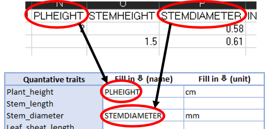
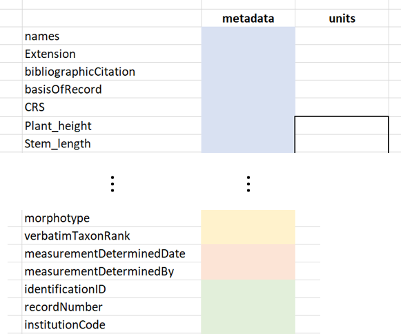

# Metadata form {#form}

This chapter explains how to use the metadaform as a dataset owner and to integrate data from heteregonous sources. The form can be downloaded from the [Github-page for this project](https://github.com/tlenters/traitData/tree/master/data_repository).

## How to fill-out the form

### Dataset information
To give information on the dataset spreadsheet as a whole, the block in the top-left of the form has to be filled in. This is used to index and add certain metadata information to be integrated by the automated R-script later on. Fig. 1 provides an example of how to fill out this block. "?" can be clicked to give information on the used terms. The coordinate reference system can be searched for in the search bar.

 
### Matching column headers
The dataset owner is expected to match the verbatim column headers from his/hers spreadsheet(s) to standardized trait- and metadata names described in the different categories. The form consists of four different categories:

* Traits
* Taxon
* Measurement or Fact
* Occurrence

For the _blue_ traits column the dataset owner matches a column header of a **quantitative** trait to standardized names that matches best with that verbatim trait name. The unit that was used to measure this trait is provided in the adjecent column. Examples would be e.g. cm, mm, m, count or degrees (Fig. 2). Column headers should **exactly** be  copied to the metadataform (including symbols and/or capital letters).

This has to be done in the same manner for the other three categories (excl. units). These categories describe metadata information instead of trait measurements. The _yellow_ taxon category is used for columns that provide additional taxonomic information for a specimen. The _orange_ measurement or fact category gives additional information at the single-measurement level or reported facts. The _green_ occurrence category provides information on the observation context of individual organisms. 

If it is not clear what is meant by a certain standardized term, the can be clicked to give a definition and additional semantic information.

### Propose new terms
In the case that none of the standardized terms match a column header, they can "added" to the form. The verbatim column header (and unit in case of traits) are given at the "..." at the bottom of each category. A descriptive name for this terms should also be given (Fig. 3).

If all **quantitative** trait headers and metadata column headers are filled-out and matched to standardized terms, the form can be saved and returned to the sender.

## Exporting data and changing features
To export the data for a filled-out form and add or change features, several sheets are available. These can be accessed by right-clicking "Form" in the bottom left and selecting "Unhide...". In the window that opens, three additional sheets can be unhidden (Fig. 4).

### Exporting data (output)
The output-sheet allows for easy extraction of the metadata filled-out in the form. The colored "metadata" column can be copied and pasted in the metadata thesaurus and the units column (only the part within the black box) in the units thesaurus (Fig. 5). These columns should be lined up with the trait and metadata terms given in the most left column. Both the metadata and the units thesaurus will be explained further in the next chapter (2). If the person who filled out the form has proposed new terms (1.1.3), these should be added manually to the thesauri.  

### Changing CRS-list (coordinates)
The coordinate-sheet holds a list of different coordinate reference systems. This list can be searched from the "dataset information" section (Fig. 1). These descriptions are later automatically translated to their respective EPSG-code[^1]. This list should usually not be edited, but if necessary, names can be edited through the "Coordinate Projection System" column. New entries can be entered by adding a new row to the table, adding the name in the "Coordinate Projection System" column and adding the subsequent number in the "Search" column. Both "Options" and "Offset" should not be edited.

[^1]: Derived from the `make_EPSG()` function in the `rgdal` package version 1.4-3. https://CRAN.R-project.org/package=rgdal

### Editing term-URIs (URIs)
This sheet connects URIs to terms shown in the form and links them to ontology defenitions and other semantic information. Where missing, URIs can be added to listed terms (these should refer to an online ontology). If new terms that are proposed (1.1.3) are suitable, the term and corresponding URI can be added at the bottom of their respective category. 