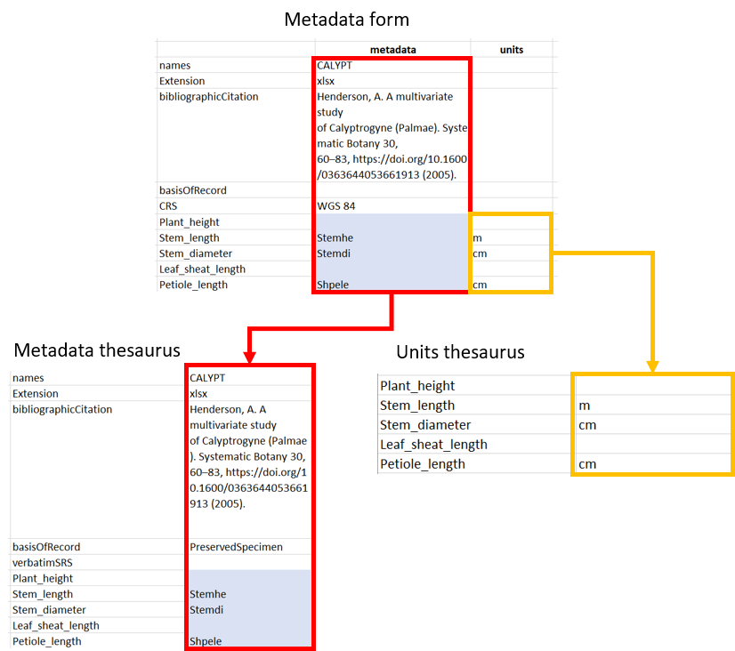

# Metadata thesauri {#thesauri}

This chapter explains how to integrate output data from the metadata form and add new terms. The thesauri can be downloaded from the [Github-page for this project](https://github.com/tlenters/traitData).

## Integrating metadata form output
Chapter 1.2.1 explains how to extract the output data from the metadataform. This output consists of two columns. The first (metadata) is copied to the "total_thesaurus.xlsx" and the second (units) to "units.xlsx". In both cases, these columns should be lined up with the "names" column in both thesauri (Fig. 6).

## Adding new terms
If new traits are proposed by the person who filled out the form, they should be added mannualy to both thesauri. 

### Metadata thesaurus
In the case of the medata thesaurus, new traits or other terms should be added as a new row directly under the corresponding category (categories are shown by different colors; Fig. 7a). Other than copying the standardized name to the "names" column, the right category should be specified in the "category" column (trait, taxon, measurement or occurrence), the class of the column entries in the dataset spreadsheet in the "classes" column (character or numeric) and the URI in the "identifier" column (Fig. 7b). All this information will later be used for the automated integration through the R-script. 

### Units thesaurus
Adding new terms to the units thesaurus can be done in a similar fashion, but only in the case of new terms of the "trait" category.  New terms should also be added at the bottom of the "names" column. Other than the "Units" output part of the metadata form (2.1) now additional information has to be added. 

**Important!** The "names" column for both thesauri should align and terms should be listed in the same order. This is to make sure that the right unit is paired with each trait name in the R-script. 
